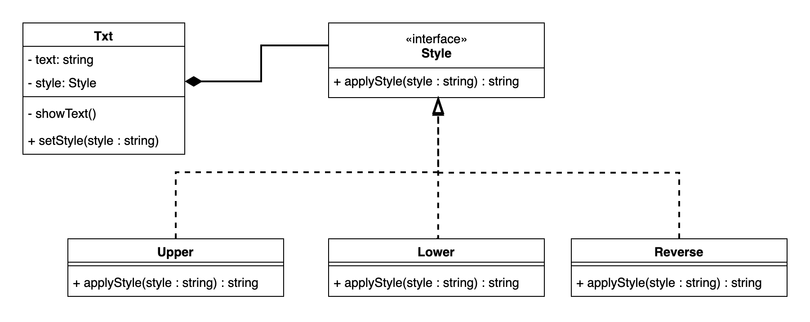

# PRG08 Strategy pattern

Codevoorbeeld waarbij het Strategy Pattern is toegepast op een class *Txt*. 

- *Txt* heeft een uitbreiding op basis van een compositie. 
- Het gedrag (object van type Upper / Lower / Reverse) kan gekoppeld worden aan de class *Txt* door middel van een variabele.
- Datatype van variable style is van type interface *Style*. Hierdoor kan elk type gedrag in de variabele gestopt worden (loose coupling). 
```
style = new Upper()
```
