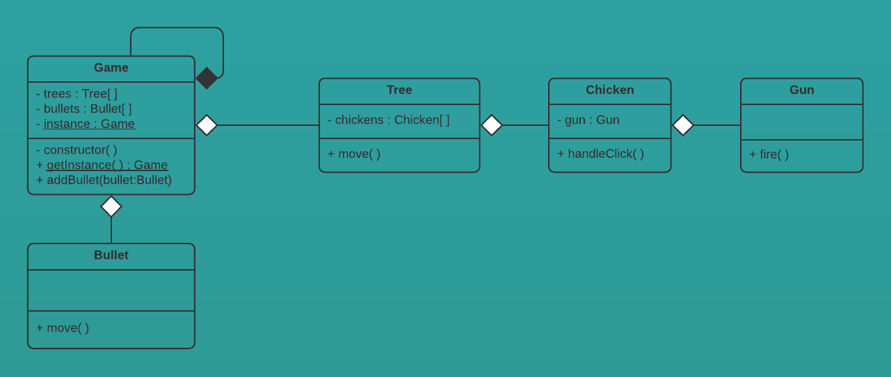

# PRG08 Strategy pattern


[Codevoorbeeld](chicken-on-a-raft) van 'chickens on a raft' waarbij van de `Game` class een *Singleton* is gemaakt. 

De drie basis onderdelen van een Singleton zijn:

1. Een private static variabele om een instance van de class zelf in op te kunnen slaan
2. Een public static functie om deze instance terug te kunnen geven. Ook wordt deze functie gebruikt om eenmalig een instantie aan te maken
3. Een private constructor zodat alleen de class zelf (eenmalig) een instantie kan aanmaken, maar voor de rest (van buiten) niemand.   

```
class Game {
        
        private static instance : Game

        public static getInstance() : Game {
            if(!Game.instance) Game.instance = new Game()
            return Game.instance
        }

        private constructor() {
            
        }

}
```

